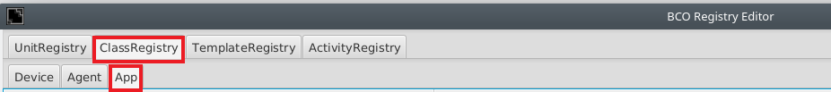
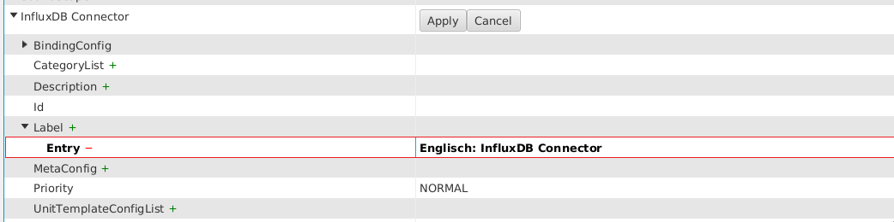
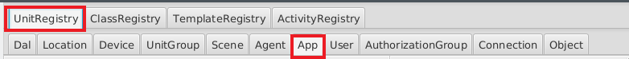
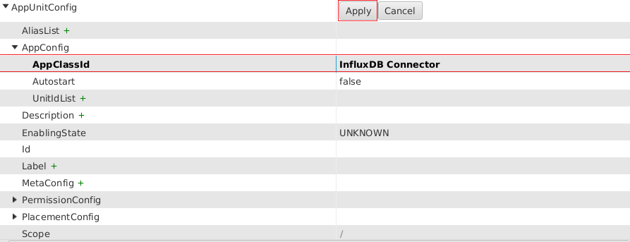
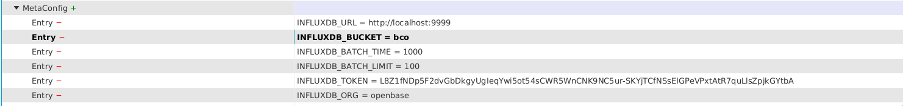

# BCO Persistence

This section introduces how ```InfluxDB ``` and the ```BCO Influxdb Connector``` app can be used to store the history of unit service state changes. This can for example be useful to compute and monitor the current economy level of the smart environment.

## How to setup InfluxDB

 Visit https://v2.docs.influxdata.com/v2.0/get-started/ to get startet with InfluxDB 2.0.  
 After you setup your initial user, bucket and organization you are able to use the database.

##  How to setup setup the ```BCO Influxdb Connector``` via ```bco-registry-editor```.
1. ### App Class
    To use the InfluxDbConnector you need to create a new InfluxDbConnector App class if it does not already exist.  
    Therefore you need to use:  
  
   Now you need to select: ClassRegistry → App  
    
   There you have to rightclick and choose "Add".  
   
   To define the new class as an InfluxDB Connector you need to add the label and apply:  <br/><br/>
   

2. ### UnitRegistry  
   To get a unit from the new class you need to register it.  
   Therefore you need to choose: UnitRegistry → App  
   
   
 
   Now add a new unit with rightlick → Add

   To add the InfluxDB connector class to the new unit, select InfluxDB Connector as AppClassId and press apply.

   
    
      
   
3. ### Available Meta Config
 The unit needs more parameters to work, so you need to add this MetaConfig parameters:

      * INFLUXDB_URL → Url of your InfluxDB
      * INFLUXDB_BUCKET → Name of the bucket where your data will be saved
      * INFLUXDB_BATCH_TIME → Time limit after your batch is written to the database
      * INFLUXDB_BATCH_LIMIT → Max size of your batch
      * INFLUXDB_TOKEN → Token which has the rights to read/write into your database
      * INFLUXDB_ORG → Org for the bucket

Info: At the moment the MetaConfig can't save '=' in the values so the '==' at the end of the token is missing.  
It will be automatically attached in the code.  
      An example config could look like this:



  

3. How to query influx db.
4. How to create a grafana widget monitoring the current power history
   1. Grafana is...


[Source Code](https://github.com/openbase/bco.app ....)


